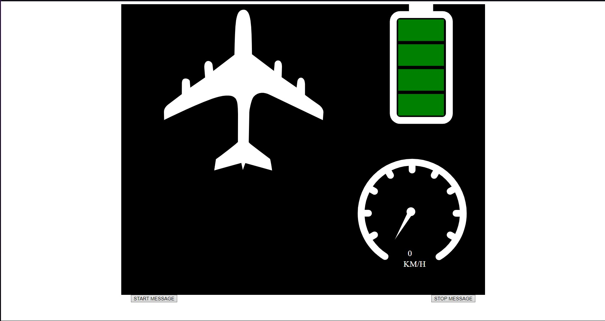
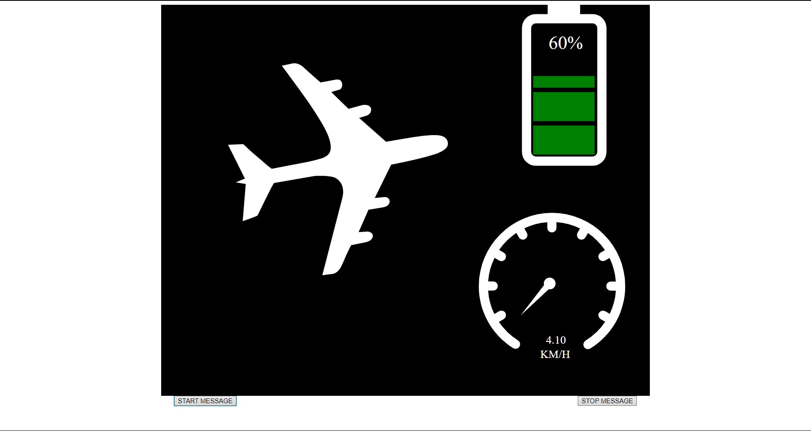
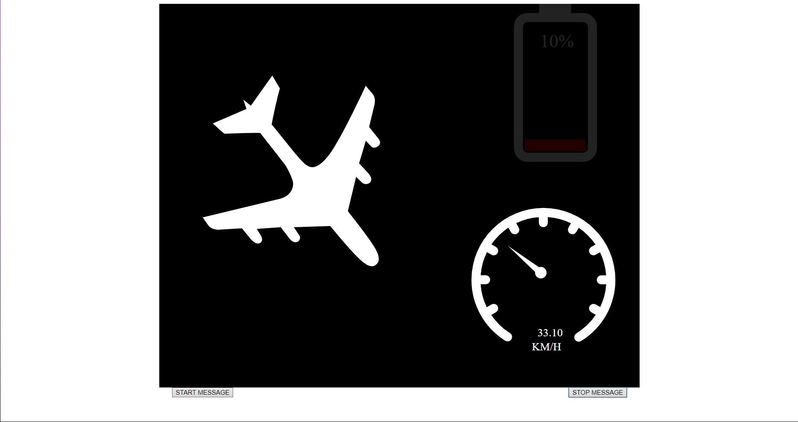
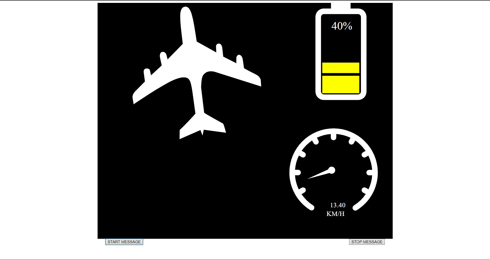

# Figter Aircraft Status System

## Project Overview

This project of mine is the Figter Aircraft Status System project.The frontend part of the project is Vite and the backend part is Node.js.
I used 3 different SVGs in this project, and thanks to the backend and websocket connection, I changed the colors, trajectories, 
etc. of these SVGs depending on the data coming from there. I changed it.
-  After running the project, go to the backend section and run the backend server with npm start, otherwise the project will not run. 

## Project Video

[Click to watch or download the video.](./public/project_video/project_video.mp4)

## Project Images

